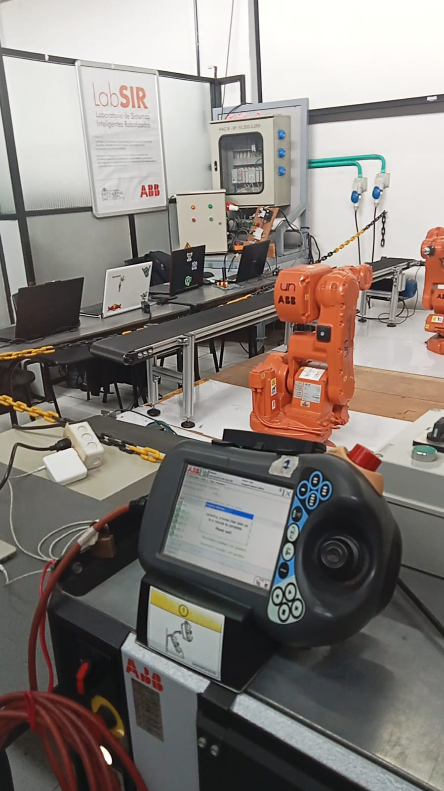
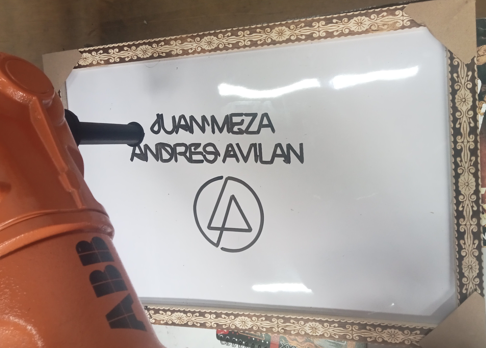
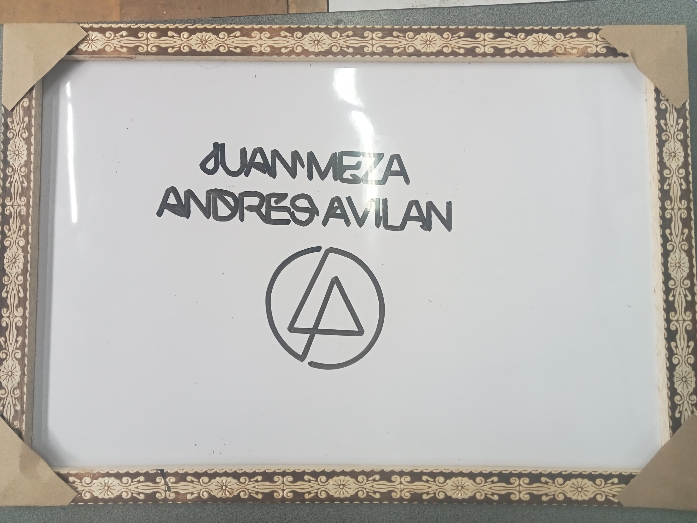

# 🦾 Laboratorio 02 – Robótica Industrial 2025-I

**Decoración automatizada de pastel con el robot ABB IRB 140**

## Integrantes del Grupo

- **Juan David Meza Criollo**
- **Andrés Mauricio Avilan Herrera**

## 🎯 Objetivos

- Comprender los tipos de movimientos (MOVJ y MOVL) en el entorno RAPID.
- Diseñar y calibrar una herramienta que simule una boquilla de decoración.
- Programar trayectorias personalizadas sobre superficies virtuales con el IRB 140.
- Utilizar funciones básicas e intermedias del lenguaje RAPID.
- Implementar control de entradas y salidas digitales.
- 
---

## 📦 Contenido del repositorio

- `codigo_rapid/` – Código fuente del proyecto en RAPID.
- `simulacion_robotstudio/` – Video de la simulación en RobotStudio.
- `herramienta/` – Diseño CAD de la herramienta creada.
- `imagenes/` – Fotografías de la herramienta física, del "pastel" decorado y las trayectorias.
- `video/` – Enlace al video del laboratorio, incluyendo simulación y ejecución real.
- `documentacion/` – Diagramas de flujo, plano de planta y descripciones del trabajo.
- `README.md` – Este documento.

---

## 🛠️ Procedimientos realizados

1. **Diseño de la herramienta**  
   - Se construyó una herramienta que fija un marcador sobre el flange del robot.
   - Se calibró la herramienta en RobotStudio y con el robot real (TCP).
   - Se importó el diseño CAD a RobotStudio y se compararon tooldata.

2. **Generación de trayectoria personalizada**  
   - Se diseñó una trayectoria que escribe los nombres de los integrantes y una figura decorativa.
   - La trayectoria se realizó con `MoveL` para asegurar continuidad.
   - Se definio la velocidad 150 mm/s y precision de Z0 para hacerlo lo mas perfecto posible.

3. **Trabajo con WorkObjects**  
   - Se acomodo la altura del tablero para la perfecta realizacion de la practica.

4. **Simulación y ejecución real**  
   - Se simuló el proceso en RobotStudio.
   - Se ejecutó en el robot ABB IRB 140, decorando físicamente la superficie de un tablero.

<p align="center">
  
</p>

---

## 🛠️ Calibración de la herramienta (Tool Center Point - TCP)

Para que el robot pueda interpretar correctamente la posición y orientación de la herramienta que diseñamos (acople para marcador), fue necesario calibrar su TCP (Tool Center Point). Esta calibración se realizó mediante el método de **toma de 4 puntos**.

1. **Fijamos la herramienta al flange del robot.**
2. **Ubicamos la punta de la herramienta sobre un punto fijo desde 4 diferentes orientaciones del brazo.**
3. **Registramos 4 posiciones de orientación distintas apuntando al mismo punto.**
4. El sistema calculó automáticamente el offset del TCP respecto al flange.


<p align="center">
  
</p>

---

## 🤖 Funcionamiento general del sistema

- El sistema inicia en posición **HOME**.
- Al recibir la primera señal de entrada, inicia la rutina de decoración (nuestra trayectoria definida).
- Al terminar, regresa a HOME.
- Si se activa la segunda señal de entrada, se posiciona en modo mantenimiento para instalar o retirar la herramienta.

---

## 📹 Video del proyecto

📺 [Ver video en YouTube](https://www.youtube.com/watch?v=ocgjGX_sios)

[](https://www.youtube.com/watch?v=ocgjGX_sios)
---

## 📸 Resultados

- Herramienta instalada con marcador en el flange del robot.
- Trazo realizado con éxito sobre superficie plana.
- Decoración incluye nombres de integrantes y patrón artístico.
- Control correcto de las señales digitales.

<p align="center">
  
  
</p>

---

## 🤖 Diagrama de Flujo del Proyecto

```mermaid
flowchart TD
    A(Inicio del proyecto) --> B(Diseño de trayectoria en RobotStudio)
    B --> C(Creación y asignación de WorkObject)
    C --> D(Diseño e importación de herramienta)
    D --> E(Calibración del TCP)
    E --> F(Simulación de movimientos en RobotStudio)
    F --> G{¿Trayectoria válida?}
    G -- No --> B
    G -- Sí --> H(Exportar código RAPID)

    H --> I(Transferencia al controlador IRC5)
    I --> J(Configurar Entradas/Salidas Digitales)
    J --> K(Inicio desde FlexPendant)

    K --> L(IRC5 ejecuta rutina RAPID)
    L --> M(Control de movimiento del IRB 140)
    M --> N(Cálculo de cinemática inversa y control motores)
    N --> O(Ejecutar trayectoria decorativa)
    O --> P{¿Entrada digital activa?}

    P -- Entrada 1 --> Q(Decoración y encender luz)
    P -- Entrada 2 --> R(Posición de mantenimiento y apagar luz)
    Q --> S(Finaliza rutina → Retorna a HOME)
    R --> S
    S --> T(Fin del proceso / Esperar nueva señal)
